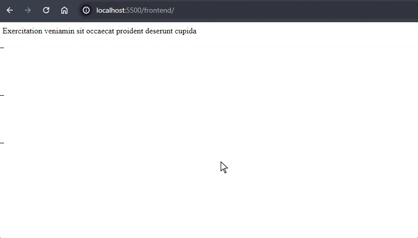

Com a alta dos modelos de linguagens (LLM) como GPT e LLaMa, tem-se voltado a falar muito sobre streams. Os modelos são relativamente lentos e aguardar até que ele termine de gerar toda a resposta seria um grande problema de usabilidade. Ou, mais especificamente, de percepção de performance.

Por isso, foi adotada a utilização de streams como boa prática na hora de lidar com esse tipo de tecnologia.

Felizmente, o próprio protocolo HTTP é capaz de lidar com streams, e é mais do que o suficiente para esse caso. Além disso, o próprio javascript suporta nativamente a criação de um objeto Response que recebe uma ReadableStream.

Para implementar isso, eu comecei com um projeto em NodeJS com express, criei uma rota GET e dentro dela uma stream de leitura com o método fs.createReadStream(), passando o caminho para um arquivo de texto local bem grande. Aqui poderia ser a stream do chatGPT, por exemplo.

```js
const p = path.join(__dirname, '../assets/file.txt');
const stream = fs.createReadStream(p, { highWaterMark: 20 });
```

O highWatermark aqui irá definir o tamanho do chunk para fins de exemplo. Não é obrigatório, a não ser que queira dar uma impressão de digitação como na API da openAI.

Como o objetivo aqui é utilizar as soluções nativas do javascript, vamos converter essa stream do Node para um ReadableStream, que é um recurso das Web APIs:

```js
const webStream = Readable.toWeb(stream);
```

Por fim, é só retornar um objeto Response passando a nossa ReadableStream:

```js
return new Response(webStream);
```

Temos então a rota GET configurada:

```js
app.get('/', (req, res) => {
  const p = path.join(__dirname, '../assets/file.txt');
  const stream = fs.createReadStream(p);

  const webStream = Readable.toWeb(stream);

  return new Response(webStream);
});
```

Este modelo de resposta funcionará tanto no node como em outros runtimes. Então pode usar no cloudflare workers ou na edge da vercel sem problemas.

No front, vamos consumir essa informação com o fetch(). O próprio “body” da resposta do fetch já é uma stream, e possui um método getReader, que possibilita ler os chunks sob demanda. Basta chamar reader.read(), que retornará um objeto contendo os atributos “value” e “done”, onde “done” é um booleano que diz se a leitura acabou ou não. Do “value”, é preciso pegar a resposta de um buffer Uint8Array, então precisaremos realizar a decodificação.

O código fica o seguinte:

```js
const decoder = new TextDecoder('utf-8');

const container = document.querySelector('main');

fetch('http://localhost:3000').then(async (res) => {
  const reader = res.body.getReader();

  let chunk = await reader.read();
  do {
    const stringValue = decoder.decode(chunk.value.buffer);

    container.innerText += stringValue;
    chunk = await reader.read();
  } while (!chunk.done && chunk.value != null);
});
```

## JSON e Metadados

Quando estamos trabalhando com LLM, muitas vezes queremos enviar ao cliente metadados, que vão desde referências, caso estejamos trabalhando com RAG, quanto tempo de geração, tokens utilizados, etc.

No entanto, passar um JSON seguindo a estratégia acima não seria muito prático, pois teríamos como resposta algo nesse sentido:

```plaintext
chunk 1:
"{\"text\":\"Lorem ips

chunk 2:
um dolor sit amet\"

chunk 3:
}"
```

Por conta disso, algumas ferramentas, como o próprio ChatGPT têm utilizado Server-Sent Events (Eventos Enviados pelo Servidor) para fazer essa comunicação. Dessa forma, temos pedaços de JSON completos, resultando em algo mais ou menos assim:

```plaintext
event 1:
{ "text": "Lorem ipsum dol" }

event 2:
{ "text": "or sit amet, consectetur adipiscing elit," }

event 3:
{ "metadata": { "links": "www.link1.com", "www.link2.com" } }
```

A partir dessa resposta, no front-end, realizamos a montagem desse texto conforme ele é gerado.

Para implementar o formato, precisamos definir os seguintes cabeçalhos para nossa resposta:

```plaintext
Content-Type: text/event-stream
Cache-Control: no-cache
```

Então, podemos enviar cada chunk em um evento diferente utilizando o seguinte formato de string:

```plaintext
data: { \"text\": \"Lorem ipsum dol\" }\n\n
```

Caso for necessário, podemos adicionar outros tipos de informação, como o tipo de evento ou um identificador:

```plaintext
id: 0
data: { \"text\": \"Lorem ipsum dol\" }
event: update
```

Para este caso, enviaremos apenas os dados. O valor padrão de event é “message”. Voltando ao nosso back-end, definimos e escrevemos nosso cabeçalho junto a um código 200, para que o cliente saiba que a conexão foi bem sucedida:

```js
const headers = {
  'Content-Type': 'text/event-stream',
  'Cache-Control': 'no-cache',
};

res.writeHead(200, headers);
```

Depois, utilizaremos a nossa ReadableStream para construir um JSON para cada chunk, e enviá-los separadamente ao front

```js
const reader = webStream.getReader();

let chunk = await reader.read();
do {
  const stringValue = decoder.decode(chunk.value.buffer);

  res.write(`data: ${JSON.stringify({ text: stringValue })}\n\n`);
  chunk = await reader.read();
} while (!chunk.done && chunk.value != null);

res.end();
```

Repare, a quebra de linha dupla (\n\n) é obrigatória ao final de cada evento. Se eu estivesse passando o id e o event, deveríamos passar a string:

```plaintext
id:0\nevent:update\ndata:value\n\n
```

Temos então a nossa rota:

```js
app.get('/', async (req, res) => {
  const p = path.join(__dirname, '../assets/file.txt');
  const stream = fs.createReadStream(p, { highWaterMark: 20 });

  const webStream = Readable.toWeb(stream);

  const headers = {
    'Content-Type': 'text/event-stream',
    'Cache-Control': 'no-cache',
  };

  res.writeHead(200, headers);

  const reader = webStream.getReader();

  let chunk = await reader.read();
  do {
    const stringValue = decoder.decode(chunk.value.buffer);

    res.write(`data: ${JSON.stringify({ text: stringValue })}\n\n`);
    chunk = await reader.read();
  } while (!chunk.done && chunk.value != null);

  res.end();
});
```

Para consumir esses eventos no front, é muito mais fácil. Basta definir um EventSource e depois adicionar um Event Listener a ele, escutando os eventos do tipo “message”:

```js
const eventSource = new EventSource('http://localhost:3000');

eventSource.addEventListener('message', (e) => {
  container.innerText += JSON.parse(e.data).text;
});
```



Referências:

[Using Readable Streams - MDN Web Docs](https://developer.mozilla.org/en-US/docs/Web/API/Streams_API/Using_readable_streams)

[Using Server-sent Events - MDN Web Docs](https://developer.mozilla.org/en-US/docs/Web/API/Server-sent_events/Using_server-sent_events)

[How To Use Server-Sent Events in Node.js to Build a Realtime App - Digital Ocean](https://www.digitalocean.com/community/tutorials/nodejs-server-sent-events-build-realtime-app)

[Server-Sent Events Crash Course - Hussein Nasser via Youtube](https://www.youtube.com/watch?v=4HlNv1qpZFY&t=1069s)
